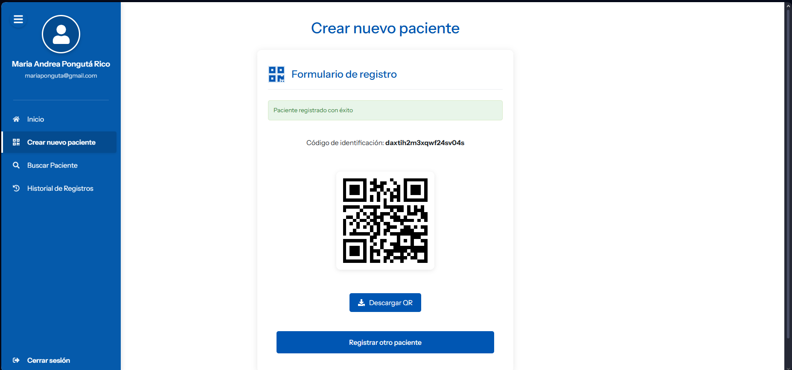

# Sistema de Gestión Digital para la Identificación de Recién Nacidos en Entornos Hospitalarios

Sistema web integral desarrollado para optimizar y digitalizar el proceso de registro, identificación y seguimiento de recién nacidos en instituciones de salud. Proporciona una solución completa que incluye registro de pacientes, generación automática de códigos QR únicos, búsqueda avanzada mediante múltiples métodos, y trazabilidad completa de actividades del personal médico.

## Descripción del Proyecto

Este sistema está diseñado para modernizar el proceso de gestión de recién nacidos en hospitales, facilitando el trabajo del personal médico (doctores y enfermeros) mediante una interfaz intuitiva y segura. La aplicación permite mantener un registro digital completo de cada bebé desde su nacimiento, incluyendo datos de identificación, medidas antropométricas, información de la madre, y estado de hospitalización.

El sistema implementa tecnología de códigos QR para facilitar la identificación rápida y precisa de los pacientes, reduciendo errores de identificación y optimizando los tiempos de búsqueda. Cada registro genera automáticamente un código QR único asociado al paciente, que puede ser escaneado desde cualquier dispositivo con cámara.

## Características Principales

### Gestión de Usuarios

- **Registro seguro de personal médico** con validación de credenciales
- **Sistema de autenticación** basado en JWT (JSON Web Tokens)
- **Perfiles diferenciados** para Doctores y Enfermeros
- **Protección de rutas** mediante autenticación requerida
- **Sesión persistente** con tokens de refresco automático

### Gestión de Pacientes

- **Registro completo de recién nacidos** con los siguientes datos:
  - Información de la madre (nombre y documento)
  - Sexo del bebé
  - Medidas antropométricas (talla y peso)
  - Fecha y hora exacta de nacimiento
  - Estado de alta hospitalaria
- **Generación automática de identificadores únicos** con formato FOSB## (secuencial)
- **Creación automática de códigos QR** para cada paciente registrado
- **Actualización de información** del paciente con registro de cambios
- **Gestión de altas hospitalarias** con actualización de estado
- **Exportación de datos** en múltiples formatos (Excel, PDF)

### Sistema de Búsqueda Avanzada

- **Búsqueda por Código QR**: Escaneo directo mediante cámara del dispositivo
- **Búsqueda por ID de Paciente**: Ingreso manual del identificador único
- **Visualización completa** de información del paciente
- **Interfaz adaptativa** según el método de búsqueda seleccionado

### Trazabilidad y Auditoría

- **Registro automático de actividades** del personal médico:
  - Búsquedas de pacientes (con método utilizado: QR o ID)
  - Creación de nuevos registros
  - Ediciones de información existente
- **Historial detallado de cambios** en la información de pacientes
- **Visualización de actividades** con filtros y paginación
- **Datos de auditoría**: usuario, fecha/hora, tipo de actividad, detalles específicos

### Interfaz de Usuario

- **Dashboard intuitivo** con acceso rápido a todas las funcionalidades
- **Diseño responsivo** adaptable a diferentes dispositivos
- **Navegación mediante sidebar** colapsable
- **Modales informativos** para visualización de datos
- **Alertas y notificaciones** con SweetAlert2
- **Iconografía clara** mediante React Icons

## Tecnologías Utilizadas

### Backend

- **Django 5.1.4**: Framework web de alto nivel para Python
- **Django REST Framework**: Desarrollo de API REST
- **Django REST Framework SimpleJWT**: Autenticación mediante tokens JWT
- **Djoser**: Gestión de autenticación y usuarios
- **Django CORS Headers**: Manejo de CORS para comunicación frontend-backend
- **Django Extensions**: Herramientas adicionales para desarrollo
- **Django Filters**: Filtrado avanzado de datos
- **SQLite**: Base de datos relacional (desarrollo)
- **Python 3.13**: Lenguaje de programación
- **Pipenv**: Gestión de dependencias y entornos virtuales

### Frontend

- **React 18.2.0**: Biblioteca de JavaScript para interfaces de usuario
- **React Router DOM 5.2.0**: Navegación y enrutamiento
- **Axios 1.9.0**: Cliente HTTP para peticiones al backend
- **html5-qrcode 2.3.8**: Escaneo de códigos QR mediante cámara
- **JWT Decode 3.1.2**: Decodificación de tokens JWT
- **SweetAlert2 11.7.5**: Alertas y notificaciones elegantes
- **jsPDF 3.0.1**: Generación de documentos PDF
- **jsPDF-AutoTable 5.0.2**: Tablas automáticas en PDF
- **XLSX 0.18.5**: Exportación de datos a Excel
- **Day.js 1.11.13**: Manejo y formateo de fechas
- **React Icons 5.5.0**: Biblioteca de iconos

### Seguridad y Desarrollo

- **HTTPS**: Comunicación segura mediante certificados SSL/TLS
- **mkcert**: Generación de certificados SSL locales confiables
- **Werkzeug y pyOpenSSL**: Soporte SSL/TLS en Django
- **CORS configurado**: Seguridad en peticiones entre dominios

## Funcionalidades Detalladas

### 1. Autenticación y Autorización

El sistema implementa un robusto sistema de autenticación que garantiza que solo personal autorizado pueda acceder:

- Pantalla de login con validación de credenciales
- Registro de nuevos usuarios con información completa (nombre, apellido, cargo)
- Tokens JWT con refresco automático para sesiones prolongadas
- Rutas privadas que redirigen a login si no hay autenticación
- Logout seguro con limpieza de tokens

### 2. Dashboard Principal

Panel de control centralizado que ofrece:

- Vista general del sistema
- Acceso rápido a las principales funcionalidades
- Navegación intuitiva mediante cards o botones
- Información del usuario autenticado

### 3. Registro de Pacientes

Formulario completo para el registro de recién nacidos:

- Validación de todos los campos requeridos
- Selectores específicos para sexo del bebé
- Campos numéricos para talla y peso con validación
- Selectores de fecha y hora para nacimiento
- Generación automática de ID único al guardar
- Creación automática de código QR vinculado
- Confirmación visual del registro exitoso
- Limpieza automática del formulario tras registro

### 4. Búsqueda de Pacientes

Interfaz dual de búsqueda con dos modalidades:

**Búsqueda por QR:**

- Activación de cámara del dispositivo
- Escáner en tiempo real con vista previa
- Detección automática y procesamiento del código
- Búsqueda instantánea al escanear

**Búsqueda por ID:**

- Campo de texto para ingresar identificador
- Validación de formato
- Botón de búsqueda explícito
- Manejo de errores si no se encuentra

### 5. Visualización de Información del Paciente

Modal completo que muestra:

- ID único del paciente
- Código QR generado (con opción de descarga/impresión)
- Información completa de la madre
- Datos del bebé (sexo, talla, peso)
- Fecha y hora de nacimiento
- Estado de alta hospitalaria
- Opciones para editar información
- Opción para dar de alta al paciente

### 6. Edición de Pacientes

Funcionalidad de actualización con:

- Modal pre-poblado con datos actuales
- Campos editables según permisos
- Validación de datos modificados
- Registro automático de cambios realizados
- Detalle de campos modificados con valores anteriores y nuevos
- Confirmación de actualización exitosa

### 7. Historial de Actividades

Vista completa de trazabilidad:

- Listado de todas las actividades del usuario
- Información por actividad:
  - Tipo de actividad (búsqueda, creación, edición)
  - Paciente asociado
  - Fecha y hora exacta
  - Método utilizado (para búsquedas: QR o ID)
  - Detalles de cambios (para ediciones)
- Paginación para mejor rendimiento
- Ordenamiento cronológico descendente

### 8. Exportación de Datos

Funcionalidades de exportación:

- Generación de reportes en PDF con formato profesional
- Exportación a Excel con datos tabulados
- Inclusión de información completa del paciente
- Formato listo para impresión o archivo

## Estructura del Proyecto

```
proyecto/
├── BackEnd/                          # Backend Django
│   ├── manage.py                     # Utilidad de gestión de Django
│   ├── Pipfile                       # Dependencias del backend
│   ├── Pipfile.lock                  # Versiones bloqueadas
│   ├── db.sqlite3                    # Base de datos SQLite
│   ├── cert.pem, key.pem             # Certificados SSL (no incluidos)
│   ├── Api/                          # Aplicación principal
│   │   ├── models.py                 # Modelos de datos
│   │   ├── serializers.py            # Serialización de datos
│   │   ├── views.py                  # Lógica de vistas
│   │   ├── urls.py                   # Rutas de la API
│   │   ├── admin.py                  # Configuración admin
│   │   └── migrations/               # Migraciones de BD
│   └── BackEnd/                      # Configuración del proyecto
│       ├── settings.py               # Configuración general
│       ├── urls.py                   # URLs principales
│       └── wsgi.py                   # Punto de entrada WSGI
│
├── FrontEnd/                         # Frontend React
│   ├── package.json                  # Dependencias del frontend
│   ├── config-overrides.js           # Configuración webpack
│   ├── public/                       # Archivos públicos
│   │   ├── index.html                # HTML principal
│   │   └── images/                   # Imágenes estáticas
│   └── src/                          # Código fuente
│       ├── App.js                    # Componente raíz
│       ├── index.js                  # Punto de entrada
│       ├── components/               # Componentes reutilizables
│       │   ├── Sidebar.js
│       │   ├── MainContent.js
│       │   ├── PatientInfoModal.js
│       │   ├── PatientRegistrationModal.js
│       │   ├── ChangeDetailsModal.js
│       │   ├── TextField.js
│       │   └── PasswordField.js
│       ├── views/                    # Vistas/Páginas
│       │   ├── Loginpage.js
│       │   ├── Dashboard.js
│       │   ├── PatientSearch.js
│       │   ├── PatientRegistration.js
│       │   └── HistoryPage.js
│       ├── context/                  # Context API
│       │   └── AuthContext.js
│       ├── utils/                    # Utilidades
│       │   ├── PrivateRoute.js
│       │   └── useAxios.js
│       ├── config/                   # Configuración
│       │   └── api.config.js
│       └── styles/                   # Hojas de estilo CSS
│
└── images/                           # Screenshots de la aplicación
```

## Requisitos Previos

Antes de comenzar, asegúrate de tener instalado:

- **Python 3.13** o superior
- **Node.js 14** o superior
- **npm** o **yarn**
- **Chocolatey** (gestor de paquetes para Windows, para instalar mkcert)
- **Git** (opcional, para clonar el repositorio)

## Instalación y Configuración Local

### 1. Clonar el Repositorio

```powershell
git clone https://github.com/Marianponguta/Identificacion-de-Recien-Nacidos.git
cd "Identificacion-de-Recien-Nacidos"
```

### 2. Configuración del Backend

#### 2.1. Navegar al directorio del backend

```powershell
cd BackEnd
```

#### 2.2. Instalar Pipenv (si no lo tienes)

```powershell
pip install pipenv
```

#### 2.3. Instalar dependencias

```powershell
pipenv install
```

#### 2.4. Activar el entorno virtual

```powershell
pipenv shell
```

#### 2.5. Realizar migraciones de la base de datos

```powershell
python manage.py migrate
```

#### 2.6. Crear un superusuario (opcional, para acceso al admin)

```powershell
python manage.py createsuperuser
```

### 3. Configuración del Frontend

#### 3.1. Abrir una nueva terminal y navegar al directorio del frontend

```powershell
cd FrontEnd
```

#### 3.2. Instalar dependencias

```powershell
npm install
```

### 4. Configuración de Certificados SSL/TLS

Para que el sistema funcione correctamente con HTTPS y el escaneo de QR, necesitas generar certificados SSL locales.

#### 4.1. Abrir VS Code como Administrador

Esto es necesario para instalar mkcert correctamente.

#### 4.2. Obtener tu dirección IP local

```powershell
ipconfig
```

Busca tu dirección IPv4 (por ejemplo: `192.168.1.22`). Anota esta IP, la necesitarás en los siguientes pasos.

#### 4.3. Instalar mkcert

```powershell
choco install mkcert
```

#### 4.4. Instalar la CA local

```powershell
mkcert -install
```

#### 4.5. Generar certificados para localhost y tu IP

```powershell
# En el directorio BackEnd
cd BackEnd
mkcert -key-file key.pem -cert-file cert.pem localhost TU_IP_AQUI

# Ejemplo:
# mkcert -key-file key.pem -cert-file cert.pem localhost 192.168.1.22
```

#### 4.6. Generar certificados para el Frontend

```powershell
# En el directorio FrontEnd
cd ../FrontEnd
mkcert -key-file key.pem -cert-file cert.pem localhost TU_IP_AQUI
```

### 5. Configurar ALLOWED_HOSTS en Django

Edita el archivo `BackEnd/BackEnd/settings.py` y actualiza la variable `ALLOWED_HOSTS` con tu IP:

```python
ALLOWED_HOSTS = ['TU_IP_AQUI']  # Por ejemplo: ['192.168.1.22']
```

También actualiza `CORS_ALLOWED_ORIGINS`:

```python
CORS_ALLOWED_ORIGINS = [
    "https://TU_IP_AQUI:3000"  # Por ejemplo: "https://192.168.1.22:3000"
]
```

### 6. Configurar la URL del API en el Frontend

Edita el archivo `FrontEnd/src/config/api.config.js` y actualiza la IP:

```javascript
export const API_BASE_URL = 'https://TU_IP_AQUI:8000/api';
```

### 7. Ejecutar la Aplicación

#### 7.1. Iniciar el Backend

```powershell
# En el directorio BackEnd (con el entorno virtual activado)
python manage.py runserver_plus TU_IP_AQUI:8000 --cert-file cert.pem --key-file key.pem

# Ejemplo:
# python manage.py runserver_plus 192.168.1.22:8000 --cert-file cert.pem --key-file key.pem
```

#### 7.2. Iniciar el Frontend

```powershell
# En el directorio FrontEnd (en una nueva terminal)
# Configurar variable de entorno para HTTPS
$env:HTTPS="true"; $env:SSL_CRT_FILE="cert.pem"; $env:SSL_KEY_FILE="key.pem"; npm start
```

### 8. Acceder a la Aplicación

#### 8.1. Verificar el Backend

1. Abre tu navegador y ve a: `https://TU_IP:8000/api/pacientes/`
2. El navegador mostrará una advertencia de seguridad (normal con certificados locales)
3. Haz clic en "Avanzado" y luego en "Continuar al sitio" o "Aceptar el riesgo"
4. Deberías ver la API de Django REST Framework

#### 8.2. Acceder al Frontend

1. Abre tu navegador y ve a: `https://TU_IP:3000/login`
2. Acepta la advertencia de seguridad si aparece
3. Deberías ver la pantalla de login

**Nota importante:** Para que el escaneo de QR funcione correctamente desde dispositivos móviles en la misma red, estos dispositivos también deben aceptar los certificados. Accede primero al endpoint del backend desde el dispositivo móvil y acepta el certificado.

## Uso del Sistema

### Crear una Cuenta de Usuario

1. Accede a la pantalla de login
2. Haz clic en el enlace de registro
3. Completa el formulario con:
   - Username (nombre de usuario único)
   - Nombre
   - Apellido
   - Cargo (Doctor o Enfermero)
   - Contraseña
4. Haz clic en "Registrar"
5. Serás redirigido al login automáticamente

### Iniciar Sesión

1. Ingresa tu username y contraseña
2. Haz clic en "Iniciar Sesión"
3. Serás redirigido al Dashboard

### Registrar un Nuevo Paciente

1. Desde el Dashboard, haz clic en "Registrar Paciente"
2. Completa el formulario con:
   - Nombre de la madre
   - Documento de la madre
   - Sexo del bebé
   - Talla (en cm)
   - Peso (en kg)
   - Fecha de nacimiento
   - Hora de nacimiento
3. Haz clic en "Registrar Paciente"
4. El sistema generará automáticamente:
   - Un ID único (formato FOSB##)
   - Un código QR asociado
5. Recibirás confirmación del registro exitoso

### Buscar un Paciente

#### Búsqueda por Código QR:

1. Desde el Dashboard, haz clic en "Buscar Paciente"
2. Selecciona la opción "Buscar por QR"
3. Permite el acceso a la cámara si el navegador lo solicita
4. Apunta la cámara al código QR del paciente
5. El sistema escaneará y buscará automáticamente
6. Se mostrará la información del paciente en un modal

#### Búsqueda por ID:

1. Desde el Dashboard, haz clic en "Buscar Paciente"
2. Selecciona la opción "Buscar por ID"
3. Ingresa el ID del paciente (ej: FOSB01)
4. Haz clic en "Buscar"
5. Se mostrará la información del paciente en un modal

### Editar Información del Paciente

1. Busca al paciente (por QR o ID)
2. En el modal de información, haz clic en "Editar"
3. Modifica los campos que necesites
4. Haz clic en "Guardar Cambios"
5. El sistema registrará automáticamente:
   - Los cambios realizados
   - Los valores anteriores y nuevos
   - Quién hizo la modificación
   - Fecha y hora del cambio

### Dar de Alta a un Paciente

1. Busca al paciente (por QR o ID)
2. En el modal de información, haz clic en "Dar de Alta"
3. Confirma la acción
4. El estado del paciente se actualizará a "Dado de alta: Sí"

### Ver Historial de Actividades

1. Desde el Dashboard, haz clic en "Historial"
2. Verás un listado de todas tus actividades:
   - Búsquedas realizadas (con método: QR o ID)
   - Pacientes creados
   - Ediciones realizadas (con detalles de cambios)
3. Usa la paginación para navegar entre registros

### Exportar Datos

1. Busca al paciente que deseas exportar
2. En el modal de información, selecciona:
   - "Exportar a PDF" para un documento PDF
   - "Exportar a Excel" para una hoja de cálculo
3. El archivo se descargará automáticamente

## Modelos de Datos

### Usuario (Perfil)

- `usuario`: Relación con User de Django
- `nombre`: Nombre del usuario
- `apellido`: Apellido del usuario
- `cargo`: Cargo (Doctor o Enfermero)

### Paciente

- `id_paciente`: Identificador único (FOSB##)
- `nombre_madre`: Nombre completo de la madre
- `documento_madre`: Documento de identidad de la madre
- `sexo_bebe`: Sexo del bebé (M/F)
- `talla`: Talla del bebé en centímetros
- `peso`: Peso del bebé en kilogramos
- `fecha_nacimiento`: Fecha de nacimiento
- `hora_nacimiento`: Hora de nacimiento
- `fecha_hora_registro`: Timestamp de creación del registro
- `dado_alta`: Estado de alta hospitalaria
- `codigo_qr`: Código QR único asociado

### Actividad de Usuario

- `usuario`: Usuario que realizó la actividad
- `tipo_actividad`: Tipo (búsqueda, creación, edición)
- `paciente`: Paciente asociado
- `fecha_hora`: Timestamp de la actividad
- `metodo_busqueda`: Método usado (QR o ID) si es búsqueda
- `detalles_cambio`: JSON con detalles de cambios si es edición

## API Endpoints

El backend expone una API REST completa para la gestión del sistema. A continuación se presenta un resumen de los endpoints principales. Para documentación detallada, consulta [API_DOCUMENTATION.md](API_DOCUMENTATION.md).

### Autenticación

- `POST /api/auth/users/` - Registro de nuevo usuario
- `POST /api/auth/token/login/` - Login (obtener token)
- `POST /api/auth/token/logout/` - Logout (invalidar token)

### Pacientes

- `GET /api/pacientes/` - Listar todos los pacientes
- `POST /api/pacientes/` - Crear nuevo paciente
- `GET /api/pacientes/{id_paciente}/` - Obtener paciente específico
- `PUT /api/pacientes/{id_paciente}/` - Actualizar paciente
- `PATCH /api/pacientes/{id_paciente}/` - Actualizar parcialmente paciente
- `POST /api/pacientes/qr/buscar/` - Buscar paciente por código QR
- `POST /api/pacientes/{id_paciente}/alta/` - Actualizar estado de alta

### Actividades

- `GET /api/actividades/` - Obtener actividades del usuario autenticado

**Documentación completa**: Consulta [API_DOCUMENTATION.md](API_DOCUMENTATION.md) para ver ejemplos de uso, formatos de datos, códigos de respuesta y más detalles.

## Archivos a Ignorar en el Repositorio

Si vas a subir este proyecto a un repositorio Git, asegúrate de crear un archivo `.gitignore` en la raíz del proyecto con el siguiente contenido:

```gitignore
# Certificados SSL
*.pem
*.crt
*.key

# Base de datos
*.sqlite3
db.sqlite3

# Python
__pycache__/
*.py[cod]
*$py.class
*.so
.Python
env/
venv/
ENV/
*.egg-info/
dist/
build/
Pipfile.lock

# Node
node_modules/
npm-debug.log*
yarn-debug.log*
yarn-error.log*
.pnp/
.pnp.js

# Production
/build
/FrontEnd/build

# IDEs
.vscode/
.idea/
*.swp
*.swo
*~

# OS
.DS_Store
Thumbs.db

# Environment variables
.env
.env.local
.env.development.local
.env.test.local
.env.production.local

# Logs
*.log
logs/

# Coverage
coverage/
.nyc_output/

# Temporary files
*.tmp
temp/
tmp/
```

## Capturas de Pantalla

### Inicio de Sesión

La pantalla de login permite a los usuarios autenticarse de forma segura en el sistema.


### Registro de Usuarios

Formulario completo para registrar nuevos miembros del personal médico con validación de campos.


### Panel de Control (Dashboard)

Vista principal del sistema con acceso rápido a todas las funcionalidades disponibles.


### Registro de Pacientes

Formulario intuitivo para el registro completo de recién nacidos con todos los datos necesarios.


### Confirmación de Registro Exitoso

Notificación visual confirmando el registro exitoso del paciente con su ID único generado.



### Búsqueda de Pacientes

Interfaz que permite elegir entre dos métodos de búsqueda: por código QR o por ID de paciente.


### Búsqueda por Código QR

Escaneo en tiempo real de códigos QR utilizando la cámara del dispositivo.


### Resultados de Búsqueda

Visualización completa de la información del paciente encontrado (por ID o QR).


### Edición de Información del Paciente

Modal que permite modificar los datos del paciente con registro automático de cambios.


### Historial de Actividades (Vista 1)

Listado cronológico de todas las actividades realizadas por el usuario autenticado.


### Historial de Actividades (Vista 2)

Detalle de las actividades mostrando tipo de acción, método utilizado y cambios realizados.


## Migración a Producción

Este proyecto está configurado para desarrollo local con SQLite. Para un entorno de producción, considera:

1. **Base de Datos**: Migrar a PostgreSQL, MySQL u otra base de datos robusta soportada por Django
2. **Servidor Web**: Usar Gunicorn o uWSGI con Nginx
3. **Certificados SSL**: Obtener certificados SSL válidos de una CA reconocida (Let's Encrypt, etc.)
4. **Variables de Entorno**: Mover configuraciones sensibles a variables de entorno
5. **DEBUG**: Configurar `DEBUG = False` en `settings.py`
6. **ALLOWED_HOSTS**: Configurar con los dominios de producción
7. **Archivos Estáticos**: Configurar `collectstatic` y servir mediante CDN o Nginx
8. **CORS**: Restringir orígenes permitidos a dominios específicos
9. **Seguridad**: Implementar medidas adicionales (rate limiting, HSTS, etc.)

## Soporte y Contribuciones

Este es un proyecto académico completo y funcional diseñado para desarrolladores que necesiten implementar soluciones similares en entornos hospitalarios o de gestión médica.

### Cómo Contribuir

Si deseas contribuir a este proyecto:

1. Lee el archivo [CONTRIBUTING.md](CONTRIBUTING.md) para conocer las directrices
2. Haz fork del repositorio
3. Crea una rama para tu funcionalidad (`git checkout -b feature/nueva-funcionalidad`)
4. Realiza tus cambios y haz commit (`git commit -m 'feat: añadir nueva funcionalidad'`)
5. Push a la rama (`git push origin feature/nueva-funcionalidad`)
6. Abre un Pull Request

### Reportar Problemas

Si encuentras algún problema o tienes sugerencias:

- Abre un issue en GitHub
- Describe detalladamente el problema o sugerencia
- Incluye screenshots si es posible
- Especifica tu entorno (SO, versiones de Python/Node, navegador)

## Preguntas Frecuentes (FAQ)

### ¿Por qué necesito HTTPS para desarrollo local?

El escaneo de códigos QR mediante la cámara del dispositivo es una funcionalidad que los navegadores modernos solo permiten en contextos seguros (HTTPS). Por eso es necesario configurar certificados SSL incluso para desarrollo local.

### ¿Puedo usar este sistema en producción?

El sistema es completamente funcional, pero está configurado para desarrollo. Para producción, debes:

- Migrar a una base de datos robusta (PostgreSQL, MySQL)
- Obtener certificados SSL válidos
- Configurar un servidor web apropiado (Nginx + Gunicorn)
- Implementar medidas de seguridad adicionales
- Configurar variables de entorno para datos sensibles

### ¿Funciona en dispositivos móviles?

Sí, el sistema es completamente responsivo y funciona en dispositivos móviles. Sin embargo, cada dispositivo que acceda debe aceptar los certificados SSL locales la primera vez.

### ¿Qué hago si el escaneo de QR no funciona?

1. Verifica que estés usando HTTPS
2. Asegúrate de haber aceptado los certificados SSL en tu dispositivo
3. Permite el acceso a la cámara cuando el navegador lo solicite
4. Verifica que la iluminación sea adecuada
5. Asegúrate de que el código QR esté dentro del marco de escaneo

### ¿Puedo cambiar el formato del ID de paciente?

Sí, puedes modificar la función `generar_id_paciente()` en `BackEnd/Api/models.py` para usar el formato que prefieras.

### ¿Cómo agrego más campos a los pacientes?

1. Modifica el modelo `Paciente` en `BackEnd/Api/models.py`
2. Actualiza el serializer en `BackEnd/Api/serializers.py`
3. Crea y ejecuta las migraciones: `python manage.py makemigrations` y `python manage.py migrate`
4. Actualiza los componentes del frontend según sea necesario

## Notas Adicionales

- El sistema está diseñado para funcionar en red local (LAN), permitiendo acceso desde múltiples dispositivos
- El escaneo de QR requiere HTTPS para funcionar correctamente por restricciones de seguridad del navegador
- Los certificados SSL deben ser aceptados en cada dispositivo que acceda al sistema
- La base de datos SQLite es adecuada para desarrollo y pruebas, pero considera migrar a una base de datos más robusta para uso en producción
- El formato de ID de paciente (FOSB##) es secuencial y automático, iniciando desde FOSB01
- El sistema registra automáticamente todas las acciones del usuario para trazabilidad completa
- Los códigos QR generados son únicos y permanentes para cada paciente
- El sistema valida todos los datos ingresados para mantener la integridad de la información

## Licencia

Este proyecto está protegido por una **Licencia de Uso No Comercial** - consulta el archivo [LICENSE](LICENSE) para más detalles.

### Derechos de Autor

**Copyright (c) 2025 Maria Andrea Pongutá Rico**

**Contribuidor:** Jose Mauricio Unda Ortiz ([GitHub](https://github.com/junda05))

Todos los derechos reservados.

### ¿Qué puedes hacer con este código?

**Permitido:**

- Ver y estudiar el código fuente con fines educativos
- Usar el software para proyectos personales, educativos o de investigación
- Modificar el código para uso personal y aprendizaje
- Compartir el código con la debida atribución a los autores

**NO Permitido:**

- Uso comercial del software o sus componentes
- Venta o distribución comercial
- Uso en productos o servicios comerciales sin autorización escrita
- Reclamar autoría del código

### Uso Comercial

Para solicitar permisos de uso comercial, por favor contacta directamente a:

- **Maria Andrea Pongutá Rico**: [mponguta@unab.edu.co](mailto:mponguta@unab.edu.co)

### Atribución Requerida

Si usas o modificas este código, debes incluir:

- El aviso de copyright
- Crédito a los autores: Maria Andrea Pongutá Rico y Jose Mauricio Unda Ortiz
- Enlace al repositorio original

## Agradecimientos

- Desarrollado como proyecto académico universitario
- Gracias a la comunidad de Django y React por la documentación y recursos
- Bibliotecas de código abierto utilizadas en este proyecto

## Autores

**Maria Andrea Pongutá Rico**

- Correo: [mponguta@unab.edu.co](mailto:mponguta@unab.edu.co)
- Autora principal del proyecto

**Jose Mauricio Unda Ortiz**

- Correo: [junda@unab.edu.co](mailto:junda@unab.edu.co)
- GitHub: [github.com/junda05](https://github.com/junda05)
- Contribuidor

## Contacto y Recursos

- **Documentación de Django**: https://docs.djangoproject.com/
- **Documentación de React**: https://react.dev/
- **Django REST Framework**: https://www.django-rest-framework.org/
- **html5-qrcode**: https://github.com/mebjas/html5-qrcode

---

**Desarrollado como proyecto académico - Sistema completo y funcional**

**Versión:** 1.0.0
**Estado:** Completo - No en producción
**Última actualización:** Octubre 2025
